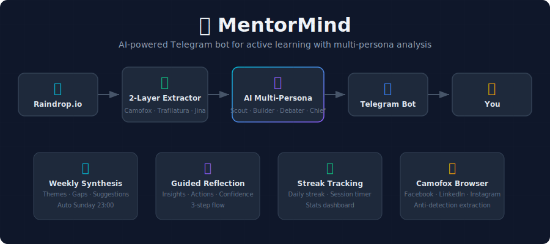

# 🧠 MentorMind

> [🇻🇳 Tiếng Việt](README.vi.md)

A personal Telegram bot for active learning — auto-syncs articles from Raindrop.io, analyzes them with AI multi-persona pipeline, and generates weekly insight reports.

## ✨ Features

| Feature | Description |
|---|---|
| **Raindrop Sync** | Auto-sync articles from Raindrop.io collection |
| **Smart Extraction** | Extract content from articles, YouTube, GitHub. Uses [Camofox](#-camofox) for Facebook/LinkedIn |
| **AI Multi-Persona Analysis** | Analysis through 4 personas: Scout → Builder → Debater → Chief |
| **Batch Overview** | Summarize 2-10 articles at once, detect common themes |
| **Reflection System** | Guided reflection after each article — record insights + action items + confidence score |
| **Weekly Synthesis** | Weekly report: themes, knowledge gaps, recommendations for next week |
| **Streak Tracking** | Daily learning streak + session timer |
| **Scheduled Jobs** | Daily auto sync+analyze + Sunday weekly report |

## 🏗️ Architecture

<p align="center">
  
</p>

##  Screenshots

<p align="center">
  
  
  
  
</p>

## 📁 Project Structure

```
├── bot/
│   └── telegram_handler.py   # Telegram command handlers
├── services/
│   ├── raindrop.py            # Raindrop.io sync
│   ├── extractor.py           # Content extraction (article/YouTube/GitHub)
│   ├── analyzer.py            # Multi-persona LLM analysis
│   ├── digest.py              # Batch overview service
│   ├── synthesizer.py         # Weekly synthesis service
│   ├── llm_client.py          # LLM client with fallback chain
│   └── scheduler.py           # APScheduler daily + weekly jobs
├── db/
│   ├── models.py              # SQLite schema
│   └── repository.py          # Database operations
├── prompts/
│   ├── personas/              # 4 persona prompts (Scout, Builder, Debater, Chief)
│   ├── digest.md              # Batch overview prompt
│   └── weekly.md              # Weekly synthesis prompt
├── config.py                  # Configuration from .env
├── main.py                    # Entry point
└── scripts/                   # Utility scripts
```

## 🚀 Quick Start

### Prerequisites

- Python 3.11+
- Telegram Bot Token ([BotFather](https://t.me/BotFather))
- Raindrop.io API Token ([raindrop.io/settings/integrations](https://raindrop.io/settings/integrations))
- LLM API endpoint (OpenAI-compatible, e.g. Antigravity Tools Proxy)
- [Camofox Browser](https://github.com/jo-inc/camofox-browser) — for Facebook/LinkedIn extraction

### Installation

```bash
# Clone
git clone <repo-url>
cd 1-Personal-AI-Learning-Assistant

# Install dependencies
pip install -r requirements.txt

# Configure
cp .env.example .env
# Edit .env with your tokens
```

### Configuration (.env)

```env
# Required
TELEGRAM_BOT_TOKEN=your-telegram-bot-token
TELEGRAM_CHAT_ID=your-chat-id
RAINDROP_API_TOKEN=your-raindrop-token

# LLM Gateway
ANTIGRAVITY_API_KEY=sk-antigravity
ANTIGRAVITY_BASE_URL=http://127.0.0.1:8045/v1

# Scheduler (daily auto job)
SCHEDULE_HOUR=8
SCHEDULE_MINUTE=0
SCHEDULE_ENABLED=true

# Timezone
TZ=Asia/Ho_Chi_Minh

# Camofox Browser (extractor for Facebook/LinkedIn posts)
CAMOFOX_URL=http://localhost:9377
CAMOFOX_USER_ID=learning-bot
CAMOFOX_API_KEY=<your_api_key>
```

### Run

```bash
python main.py
```

## 📱 Commands

### 📖 Learning
| Command | Description |
|---|---|
| `/analyze` | Analyze next article (latest, highest priority) |
| `/analyze <id>` | Analyze specific article by DB ID |
| `/next` | Preview next article (without analyzing) |
| `/skip` | Skip next article |
| `/overview` | Overview of 5 latest queued articles |
| `/overview <n>` | Overview of n articles (2-10) |
| `/reflect` | Reflect on the last read article |
| `/reflect <id>` | Reflect on specific article |
| `/weekly` | Generate weekly learning synthesis |

### ⏱️ Tracking
| Command | Description |
|---|---|
| `/session start` | Start a learning session |
| `/session stop` | End session |
| `/session` | View current session |
| `/status` | Stats + streak |

### ⚙️ Management
| Command | Description |
|---|---|
| `/sync` | Sync new articles from Raindrop |
| `/schedule` | View/change auto schedule |
| `/help` | List all commands |

## 🔄 Learning Flow

<p align="center">
  
</p>


## 🔬 2-Layer Intelligent Extraction

The extractor uses a **2-layer optimization pipeline** to ensure content quality:

**Layer 1 — Raw Extraction** (select best source):
```
URL → Detect content type
  │
  ├─ Walled garden? → Camofox (full render) → OG meta (fallback)
  ├─ YouTube?       → Transcript API (vi → en → auto)
  └─ Article?       → Trafilatura (primary) → Jina Reader (fallback)
```

**Layer 2 — Content Optimization** (clean + enrich):
```
Raw content → Short content? (<100 words)
  ├─ yes → Find URLs in content/excerpt → Follow link → Re-extract
  └─ Camofox snapshot? → clean_camofox_snapshot() (strip UI noise, keep real text)
      → Raw 10K chars → Cleaned ~3K chars (60-70% reduction)
```

> When original content is too short (social posts sharing links), Layer 2 automatically follows URLs in the content to fetch the full article.

## 🤖 AI Multi-Persona Analysis

Each article goes through a 2-stage analysis pipeline:

**Stage 1 — Research:**
- 🔬 **Scout** (Researcher): Explores and analyzes technical content, extracts key insights

**Stage 2 — Synthesis:**
- 🏗️ **Builder** (Architect): System design, evaluates practical applicability
- 🤔 **Debater** (Skeptic): Challenges claims, asks hard questions, finds gaps
- 📝 **Chief** (Synthesizer): Synthesizes insights, delivers final conclusions

## 🛠️ Tech Stack

| Component | Technology |
|---|---|
| Bot Framework | python-telegram-bot 21+ |
| LLM Client | OpenAI SDK (via proxy) |
| Database | SQLite |
| Scheduler | APScheduler |
| Content Extraction | Trafilatura, BeautifulSoup4, youtube-transcript-api |
| HTTP | httpx |

## 📅 Scheduled Jobs

| Job | Schedule | Action |
|---|---|---|
| Daily Sync & Analyze | Configurable (default 08:00) | Sync Raindrop → analyze 1 article → send result |
| Weekly Synthesis | Sunday 23:00 | Weekly report → send to Telegram |

## 🦊 Camofox

The bot uses [Camofox Browser](https://github.com/jo-inc/camofox-browser) — a headless browser built on **Camoufox** (Firefox fork with C++ anti-detection) — to extract content from bot-protected platforms.

**Supported**: Facebook posts/reels, LinkedIn articles, Instagram

**Features**:
- Full page render with anti-detection (bypass bot checks)
- Accessibility snapshot → `clean_camofox_snapshot()` strips UI noise, keeps real text
- Screenshot for multimodal Gemini analysis
- Link extraction (detect links in comments)

### Facebook Cookie Import

By default, Camofox can access public content. To read **full content** (comments, full post text, private groups), import Facebook cookies:

```bash
# 1. Install "cookies.txt" browser extension (Chrome/Firefox)
# 2. Export cookies for facebook.com (Netscape format)
# 3. Place in Camofox directory
mkdir -p ~/.camofox/cookies
cp ~/Downloads/facebook_cookies.txt ~/.camofox/cookies/facebook.txt
```

With cookies imported, Camofox renders the page as a logged-in user — giving access to full post content + comments.

See detailed setup: [`docs/camofox_setup.md`](docs/camofox_setup.md)

## 📐 OpenSpec — Spec-Driven Development

This project is developed using the **spec-driven** methodology with [OpenSpec](https://github.com/9aia/openspec) — a framework for managing changes through artifacts (proposal → design → specs → tasks).

### Why OpenSpec?

- **Traceability**: Every feature has a full proposal, design rationale, behavioral specs, and task breakdown
- **Incremental delivery**: Changes are broken into scoped, manageable units
- **Living documentation**: Specs reflect the current state of the system, not write-once-forget docs

### Workflow customization

OpenSpec's default workflows are customized in `.agent/workflows/`. One notable change:

**`opsx-archive.md`** — added guardrail:
```
ALWAYS update openspec/ROADMAP.md after archiving
```

Reason: ROADMAP.md is the single source of truth for project progress. Without this rule, archiving a change would leave ROADMAP out of sync with reality. This guardrail ensures that after every archive, the change is automatically moved from "Remaining" to "Completed" with the archive date.

### Project structure

```
openspec/
├── ROADMAP.md              # Overall progress — single source of truth
├── specs/                  # Main specs (behavioral requirements)
│   ├── article-flow/
│   ├── telegram-bot/
│   ├── weekly-synthesis/
│   └── ...
└── changes/
    └── archive/            # Completed changes (10 changes archived)
        ├── 2026-02-15-select-llm-model/
        ├── 2026-02-15-setup-database/
        └── ...
```

### Lessons learned

OpenSpec excels at managing individual changes, but has 2 weaknesses for multi-phase projects:

| Weakness | Problem | Workaround |
|---|---|---|
| **No overall progress tracking** | Each change is a silo, no "project dashboard" | Created `ROADMAP.md` manually + guardrail to auto-update on archive |
| **No auto-merge of specs** | Delta specs from multiple changes don't auto-merge into main spec | Run `/opsx-sync` before archive — but easy to forget (happened once) |

If you use OpenSpec for a large project, we recommend:
1. Create `ROADMAP.md` from the start
2. Add "update ROADMAP" guardrail to your archive workflow
3. Always sync delta specs before archiving
