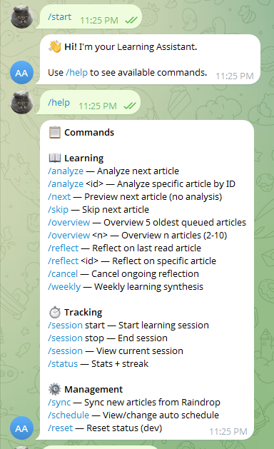
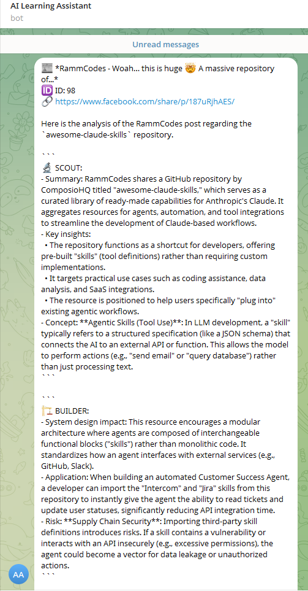
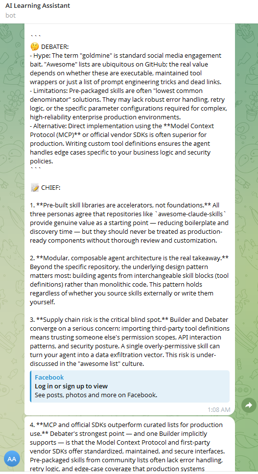
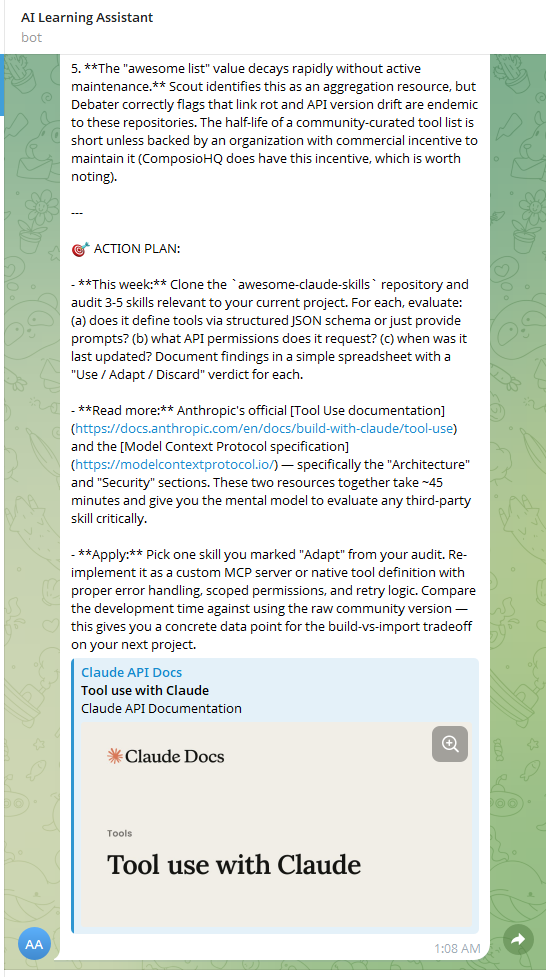

# 🧠 MentorMind

> [🇬🇧 English](README.md)

Telegram bot cá nhân hỗ trợ học tập chủ động — tự động sync bài viết từ Raindrop.io, phân tích bằng AI multi-persona, và tổng hợp insights hàng tuần.

## ✨ Features

| Feature | Mô tả |
|---|---|
| **Raindrop Sync** | Tự động sync bài viết từ Raindrop.io collection |
| **Smart Extraction** | Trích xuất nội dung từ articles, YouTube, GitHub. Dùng [Camofox](#-camofox) cho Facebook/LinkedIn |
| **AI Multi-Persona Analysis** | Phân tích qua 4 personas: Scout → Builder → Debater → Chief |
| **Batch Overview** | Tóm tắt batch 2-10 bài cùng lúc, phát hiện themes chung |
| **Reflection System** | Guided reflection sau mỗi bài — ghi lại insight + action item + confidence score |
| **Weekly Synthesis** | Tổng hợp tuần: themes, knowledge gaps, gợi ý tuần tới |
| **Streak Tracking** | Track learning streak hàng ngày + session timer |
| **Scheduled Jobs** | Daily auto sync+analyze + Sunday weekly report |

## 🏗️ Architecture

```
┌─────────────┐     ┌──────────────┐     ┌─────────────┐
│  Raindrop   │────▶│   Bot Core   │────▶│  Telegram    │
│  (Source)    │     │              │     │  (Output)    │
└─────────────┘     └──────┬───────┘     └─────────────┘
                           │
              ┌────────────┼────────────┐
              ▼            ▼            ▼
        ┌──────────┐ ┌──────────┐ ┌──────────┐
        │ Extractor│ │ Analyzer │ │Synthesizer│
        │          │ │(4 persona│ │  (Weekly) │
        └────┬─────┘ └──────────┘ └──────────┘
             │
    ┌────────┼────────┐
    ▼        ▼        ▼
┌────────┐┌───────┐┌──────┐
│Camofox ││Trafi- ││ Jina │
│Browser ││latura ││Reader│
└────────┘└───────┘└──────┘
              │
              ▼
       ┌──────────────┐
       │   SQLite DB  │
       └──────────────┘
```

</p>

## Screenshots

<p align="center">
  
  
  
  
</p>

## 📁 Project Structure

```
├── bot/
│   └── telegram_handler.py   # Telegram command handlers
├── services/
│   ├── raindrop.py            # Raindrop.io sync
│   ├── extractor.py           # Content extraction (article/YouTube/GitHub)
│   ├── analyzer.py            # Multi-persona LLM analysis
│   ├── digest.py              # Batch overview service
│   ├── synthesizer.py         # Weekly synthesis service
│   ├── llm_client.py          # LLM client with fallback chain
│   └── scheduler.py           # APScheduler daily + weekly jobs
├── db/
│   ├── models.py              # SQLite schema
│   └── repository.py          # Database operations
├── prompts/
│   ├── personas/              # 4 persona prompts (researcher, architect, skeptic, synthesizer)
│   ├── digest.md              # Batch overview prompt
│   └── weekly.md              # Weekly synthesis prompt
├── config.py                  # Configuration from .env
├── main.py                    # Entry point
└── scripts/                   # Utility scripts
```

## 🚀 Quick Start

### Prerequisites

- Python 3.11+
- Telegram Bot Token ([BotFather](https://t.me/BotFather))
- Raindrop.io API Token ([raindrop.io/settings/integrations](https://raindrop.io/settings/integrations))
- LLM API endpoint (OpenAI-compatible, e.g. Antigravity Tools Proxy)
- [Camofox Browser](https://github.com/jo-inc/camofox-browser) — cho Facebook/LinkedIn extraction

### Installation

```bash
# Clone
git clone <repo-url>
cd 1-Personal-AI-Learning-Assistant

# Install dependencies
pip install -r requirements.txt

# Configure
cp .env.example .env
# Edit .env with your tokens
```

### Configuration (.env)

```env
# Required
TELEGRAM_BOT_TOKEN=your-telegram-bot-token
TELEGRAM_CHAT_ID=your-chat-id
RAINDROP_API_TOKEN=your-raindrop-token

# LLM Gateway
ANTIGRAVITY_API_KEY=sk-antigravity
ANTIGRAVITY_BASE_URL=http://127.0.0.1:8045/v1

# Scheduler (daily auto job)
SCHEDULE_HOUR=8
SCHEDULE_MINUTE=0
SCHEDULE_ENABLED=true

# Timezone
TZ=Asia/Ho_Chi_Minh

# Language (vi = Tiếng Việt, en = English)
LANGUAGE=vi

# Camofox Browser (extractor for Facebook/LinkedIn ... post)
CAMOFOX_URL=http://localhost:9377
CAMOFOX_USER_ID=learning-bot
CAMOFOX_API_KEY=<your_api_key>
```

## 🌐 Đa ngôn ngữ (i18n)

MentorMind hỗ trợ **Tiếng Việt** và **Tiếng Anh** cho toàn bộ tin nhắn bot.

| Cài đặt | Ngôn ngữ |
|---|---|
| `LANGUAGE=vi` | 🇻🇳 Tiếng Việt (mặc định) |
| `LANGUAGE=en` | 🇬🇧 Tiếng Anh |

Toàn bộ UI strings được quản lý trong `strings.py`. LLM prompts cũng được bản địa hóa tại `prompts/vi/` và `prompts/en/`.

### Run

```bash
python main.py
```

## 📱 Commands

### 📖 Học tập
| Command | Mô tả |
|---|---|
| `/analyze` | Phân tích bài tiếp theo (mới nhất, priority cao nhất) |
| `/analyze <id>` | Phân tích bài cụ thể theo DB ID |
| `/next` | Xem bài tiếp theo (không phân tích) |
| `/skip` | Bỏ qua bài tiếp theo |
| `/overview` | Overview 5 bài queued mới nhất |
| `/overview <n>` | Overview n bài (2-10) |
| `/reflect` | Reflect bài vừa đọc |
| `/reflect <id>` | Reflect bài cụ thể |
| `/weekly` | Tổng hợp tuần học tập |

### ⏱️ Tracking
| Command | Mô tả |
|---|---|
| `/session start` | Bắt đầu session học |
| `/session stop` | Kết thúc session |
| `/session` | Xem session hiện tại |
| `/status` | Thống kê + streak |

### ⚙️ Quản lý
| Command | Mô tả |
|---|---|
| `/sync` | Sync bài mới từ Raindrop |
| `/schedule` | Xem/đổi lịch tự động |
| `/help` | Danh sách commands |

## 🔄 Learning Flow

<p align="center">
  
</p>

## 🔬 2-Layer Intelligent Extraction

Extractor sử dụng pipeline **2 lần tối ưu** để đảm bảo chất lượng nội dung:

**Layer 1 — Raw Extraction** (chọn nguồn tốt nhất):
```
URL → Detect content type
  │
  ├─ Walled garden? → Camofox (full render) → OG meta (fallback)
  ├─ YouTube?       → Transcript API (vi → en → auto)
  └─ Article?       → Trafilatura (primary) → Jina Reader (fallback)
```

**Layer 2 — Content Optimization** (làm sạch + enrich):
```
Raw content → Short content? (<100 words)
  ├─ yes → Tìm URL trong bài/excerpt → Follow link → Extract lại
  └─ Camofox snapshot? → clean_camofox_snapshot() (loại UI noise, giữ text thật)
      → Raw 10K chars → Cleaned ~3K chars (giảm 60-70%)
```

> Khi bài gốc quá ngắn (social post chia sẻ link), Layer 2 tự động follow URL trong nội dung để lấy bài đầy đủ.

## 🤖 AI Multi-Persona Analysis

Mỗi bài viết được phân tích qua 2 stages:

**Stage 1 — Research:**
- 🔬 **Scout** (Researcher): Khám phá và phân tích nội dung kỹ thuật, trích xuất key insights

**Stage 2 — Synthesis:**
- 🏗️ **Builder** (Architect): Thiết kế hệ thống, đánh giá tính ứng dụng thực tế
- 🤔 **Debater** (Skeptic): Phản biện, đặt câu hỏi, thách thức tuyên bố
- 📝 **Chief** (Synthesizer): Tổng hợp, chắt lọc insights, đưa ra kết luận cuối cùng

## 🛠️ Tech Stack

| Component | Technology |
|---|---|
| Bot Framework | python-telegram-bot 21+ |
| LLM Client | OpenAI SDK (via proxy) |
| Database | SQLite |
| Scheduler | APScheduler |
| Content Extraction | Trafilatura, BeautifulSoup4, youtube-transcript-api |
| HTTP | httpx |

## 📅 Scheduled Jobs

| Job | Schedule | Action |
|---|---|---|
| Daily Sync & Analyze | Configurable (default 08:00) | Sync Raindrop → analyze 1 bài → send kết quả |
| Weekly Synthesis | Sunday 23:00 | Tổng hợp tuần → send report |

## 🦊 Camofox

Bot sử dụng [Camofox Browser](https://github.com/jo-inc/camofox-browser) — headless browser trên nền **Camoufox** (Firefox fork với anti-detection C++) — để extract nội dung từ các trang có chặn bot.

**Hỗ trợ**: Facebook posts/reels, LinkedIn articles, Instagram

**Tính năng**:
- Full page render với anti-detection (bypass bot check)
- Accessibility snapshot → `clean_camofox_snapshot()` loại noise, giữ text thật
- Screenshot cho multimodal Gemini analysis
- Link extraction (phát hiện link trong comments)

### Facebook Cookie Import

Mặc định Camofox lấy được nội dung public. Để đọc **full content** (comments, full post text, private groups), cần import Facebook cookies:

```bash
# 1. Cài extension "cookies.txt" (Chrome/Firefox)
# 2. Export cookies cho facebook.com (Netscape format)
# 3. Đặt vào thư mục Camofox
mkdir -p ~/.camofox/cookies
cp ~/Downloads/facebook_cookies.txt ~/.camofox/cookies/facebook.txt
```

Khi có cookies, Camofox render page như user đã login → lấy được toàn bộ nội dung bài viết + comments.

Xem chi tiết setup: [`docs/camofox_setup.md`](docs/camofox_setup.md)

## 📐 OpenSpec — Spec-Driven Development

Project này được phát triển theo phương pháp **spec-driven** sử dụng [OpenSpec](https://github.com/9aia/openspec) — một framework quản lý thay đổi qua artifacts (proposal → design → specs → tasks).

### Tại sao dùng OpenSpec?

- **Traceability**: Mỗi feature có đầy đủ proposal, design rationale, behavioral specs, và task breakdown
- **Incremental delivery**: Chia nhỏ thay đổi thành changes, mỗi change có scope rõ ràng
- **Living documentation**: Specs phản ánh trạng thái hiện tại của hệ thống, không phải docs viết xong rồi bỏ

### Workflow customization

Workflow mặc định của OpenSpec được customize tại `.agent/workflows/`. Một thay đổi đáng chú ý:

**`opsx-archive.md`** — thêm guardrail:
```
ALWAYS update openspec/ROADMAP.md after archiving
```

Lý do: ROADMAP.md là single source of truth cho tiến độ project. Nếu archive change mà không update ROADMAP, sẽ mất đồng bộ giữa trạng thái thực tế và documentation. Rule này đảm bảo mỗi khi archive xong, ROADMAP tự động được cập nhật — move change từ "Remaining" sang "Completed" kèm ngày archive.

### Project structure

```
openspec/
├── ROADMAP.md              # Tiến độ tổng quan — single source of truth
├── specs/                  # Main specs (behavioral requirements)
│   ├── article-flow/
│   ├── telegram-bot/
│   ├── weekly-synthesis/
│   └── ...
└── changes/
    └── archive/            # Completed changes (10 changes archived)
        ├── 2026-02-15-select-llm-model/
        ├── 2026-02-15-setup-database/
        └── ...
```

### Lessons learned

OpenSpec rất tốt cho việc quản lý từng change riêng lẻ, nhưng có 2 điểm yếu khi dùng cho project nhiều phases:

| Điểm yếu | Vấn đề | Workaround |
|---|---|---|
| **Không tracking progress tổng quan** | Mỗi change là một silo, không có "project dashboard" | Tạo `ROADMAP.md` thủ công + guardrail auto-update khi archive |
| **Không auto-merge specs** | Delta specs từ nhiều changes không tự nối vào main spec | Chạy `/opsx-sync` trước archive — nhưng dễ quên (đã xảy ra 1 lần) |

Nếu bạn dùng OpenSpec cho project lớn, recommend:
1. Tạo `ROADMAP.md` ngay từ đầu
2. Thêm guardrail "update ROADMAP" vào archive workflow
3. Luôn sync delta specs trước khi archive
